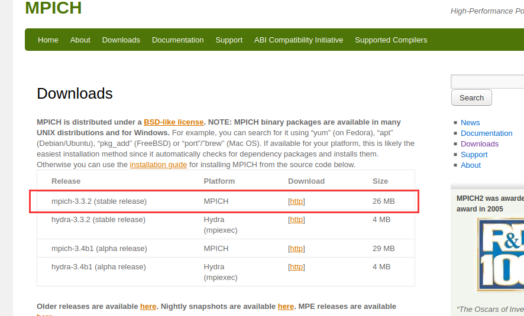
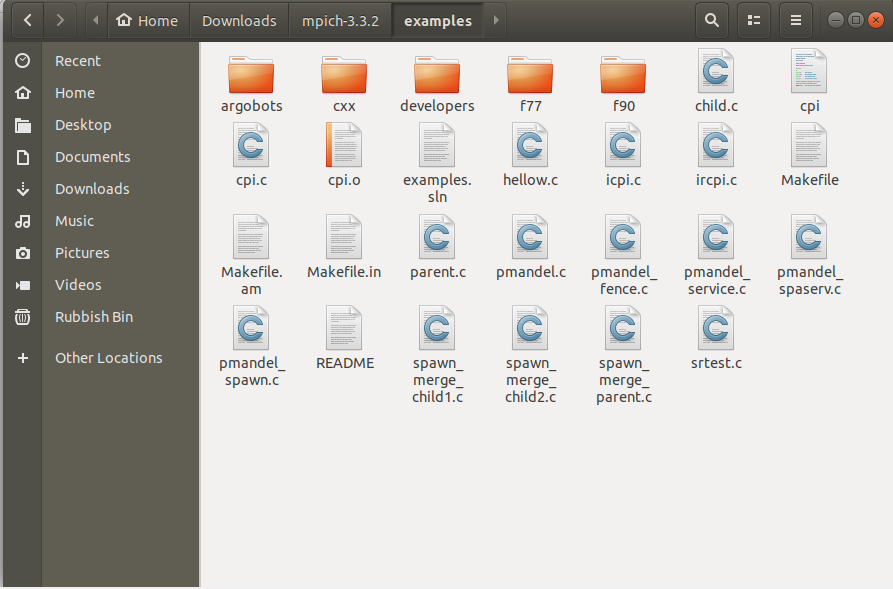

# MPI环境配置

## Section 1. mpich(Linux版MPI) 与 MsMPI(Windows版MPI)

笔者在这里仅对Linux版本的MPI进行介绍.MacOS的MPI我没用过不知道效果如何.

对于初学者强烈不建议使用Windows版本MPI进行学习, 原因主要有以下两个

1. 数据长度混乱
   
    其中一个例子是在Windows中MPI_Double长度为4个字节,而double长度为8个字节. 在使用MPI I/O进行二进制数据读取时会发生内存溢出的错误. 而在Linux中, 基础数据类型与对应的MPI数据类型长度是一致的.

2. 难以Debug
   
    在MPI出现通信/内存错误时, Windows MPI不会打印出在出现通信错误之前需要print的内容, 仅仅会简单地陷入死循环或报内存错误. 在多次调用MPI方法的前提下, 你是无法判断在哪一步调用时出现了问题的. mpich则不会存在这种现象, 完全可以在每一个调用之前使用print查看目前进行到了哪里, 程序是在哪一次调用时出现内存错误的.


## Section 2. mpich安装(以Ubuntu 18.04.3为例)

虚拟机的安装不再赘述, 目前的虚拟机平台主要有Oracle VirtualBox, VMWare 和 Hyper-V. 

对于学生推荐使用Oracle VirtualBox, 免费且功能足够使用. VMWare的非阉割版本(阉割版本还不如VirtualBox)为收费软件, 仅仅为了学习MPI没有必要去花这个钱. Hyper-V是Windows 10自带的免费虚拟化工具但需要在设置中启用, 而在MacOS中无法安装.

### 1. 下载

到[mpich网站](https://www.mpich.org/downloads/)下载最新的stable release版本, 如图:



### 2. 解压

进入下载目录, 右键打开菜单打开终端,输入

```shell
tar -xvf mpich-3.3.2.tar.gz
```

自动开始解压.注意将`mpich-3.3.tar.gz`换成你下载的压缩文件的完整名称.

部分版本linux无法自动识别tar文件格式, 需要将`-xvf`换成`-zxvf`

### 3. 编译

在编译之前检查以下编译器是否已经安装(否则会在编译时报错)

#### 3.1 检查gcc (C语言编译器)

```shell
gcc --version
```

出现类似以下输出时表示gcc已安装且无错误

```plain
gcc (Ubuntu 7.5.0-3ubuntu1~18.04) 7.5.0
Copyright (C) 2017 Free Software Foundation, Inc.
This is free software; see the source for copying conditions.  There is NO
warranty; not even for MERCHANTABILITY or FITNESS FOR A PARTICULAR PURPOSE.
```

#### 3.2 检查g++(C++编译器)

```shell
g++ --version
```

出现类似以下输出时表示g++已安装且无错误

```plain
g++ (Ubuntu 7.5.0-3ubuntu1~18.04) 7.5.0
Copyright (C) 2017 Free Software Foundation, Inc.
This is free software; see the source for copying conditions.  There is NO
warranty; not even for MERCHANTABILITY or FITNESS FOR A PARTICULAR PURPOSE.
```

#### 3.3 检查gfortran(Fortran编译器)

gcc和g++在linux中其实是默认安装的,然而Fortran不是.大部分人后续的安装报错都是因为没有安装Fortran.

```shell
gfortran --version
```

如果报出类似

```plain
Command 'gfortran' not found
```

的错误, 那么需要安装gfortran

gfortran的安装方式取决于你的linux版本,在Ubuntu下, 可以直接使用

```plain
sudo apt install gfortran
```

而其他版本(例如Centos) Linux的包管理工具与Ubuntu不同, 不一定有apt. 建议自行查询安装方式.

安装完成后再检查一次,如果出现类似输出

```plain
GNU Fortran (Ubuntu 7.5.0-3ubuntu1~18.04) 7.5.0
Copyright (C) 2017 Free Software Foundation, Inc.
This is free software; see the source for copying conditions.  There is NO
warranty; not even for MERCHANTABILITY or FITNESS FOR A PARTICULAR PURPOSE.
```

表示gfortran安装成功.

#### 3.4 编译与安装

进入解压后的目录

```shell
cd mpich-3.3.2
```

这里要将mpich-3.3.2换成你压缩包解压后的文件夹名字

然后开始配置编译环境

```shell
./configure  --prefix=/usr/local/mpi
```

输入后按Enter, 屏幕会开始疯狂地滚动. 等他滚完之后如果最后一句是`Configuration completed.` 就表示配置成功了(如果少了上面所说的三个环境,会出现`configure: error xxxxx`)

这个配置命令的意思是在编译后将mpi安装至`/usr/local/mpi`文件夹下

然后就是大家都懂的make环节, 输入

```shell
make
```

编译, 编译完成之后使用

```shell
sudo make install
```

将mpi安装在configure配置的目录下. 很多安装教程里写的都是`make install`, 但如果不用sudo, 在安装至部分系统保护文件夹时会出现permission deny的错误

#### 3.5 配置环境变量

用vi打开bashrc文件

```shell
sudo vi  ~/.bashrc
```
进去之后按大写G(shift + g 或 CAPS + g + CAPS都可以)将光标定位至文件末尾(不要用鼠标点,vi/vim和普通人常用的文本编辑工具操作是完全不同的), 按i进入编辑模式, 复制以下文本命令按 Ctrl + V 将其黏贴到文件最后

```plain
export MPI_ROOT=/usr/local/mpi
export PATH=$MPI_ROOT/bin:$PATH      
export MANPATH=$MPI_ROOT/man:$MANPATH
```

esc退出编辑模式, :wq保存退出vi

然后使用

```shell
source ~/.bashrc
```
让配置文件生效

#### 3.6 测试

回到前面解压出来的文件夹, 在我这里是 mpich-3.3.2. 进入该文件夹中的example子文件夹,如图所示:



在这里打开终端,使用以下命令将hellow.c编译为可执行文件hellow

```shell
mpicc -o hellow hellow.c
```

然后运行

```shell
mpirun -n 4 ./hellow
```

出现类似以下的结果表明安装成功

```plain
Hello world from process 1 of 4
Hello world from process 0 of 4
Hello world from process 3 of 4
Hello world from process 2 of 4
```