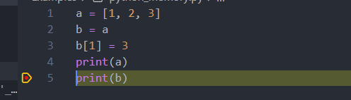
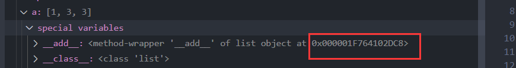
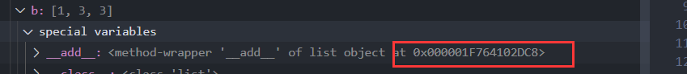

# 预备知识: C语言指针

对指针熟悉的读者建议直接跳过,本小节只是对通过Python等类脚本语言入门, 对指针概念不是非常了解的读者做一个科普, 否则难以入门MPI.

## 指针是什么 - 在Python背景下的理解

在使用Python进行一些简单编程(爬虫, excel处理等)任务时大都不涉及指针概念. 但是有一个著名大坑想必90%初学者都踩过: 列表的复制

尝试运行以下Python代码:
```python
a = [1, 2, 3]
b = a
b[1] = 3
print(a)
print(b)
```
结果:
```
a = [1, 3, 3]
b = [1, 3, 3]
```
可以发现在初始化b为a的前提下, 改变b的第二个元素(位置1)时a的第二个元素也跟着改变, 这里的原理是**b实际上复制了a指向内存地址的指针, 而非很多新手所想的,将元素数值复制到了不同的地方**

使用IDE进行调试能够更好的理解这个概念

在VSCode中进行断点调试如图:


点开debug面板,可以看到a和b两个变量

分别查看其内存地址,可以发现他们所指向的存储首地址完全相同



所以改变`b[1]`的过程其实是改变了`b[1]`这个指针所指向的内存位置中所存储的值.在获取列表a存储的元素数值时, 其实是获取`a[0]`, `a[1]`, `a[2]`所指向内存中的值,而`a[1]`和`b[1]`指向的是同一个位置,所以改变`b[1]`时`a[1]`对应的值也会改变

